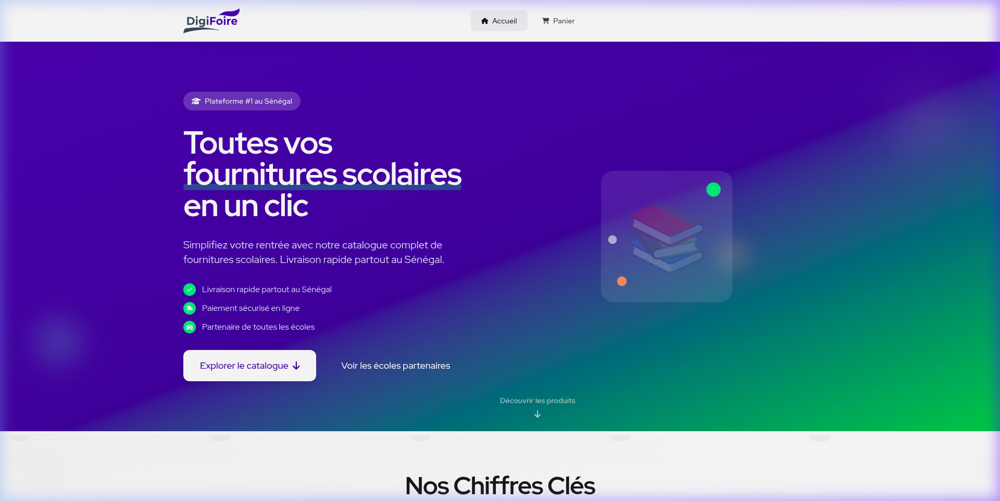
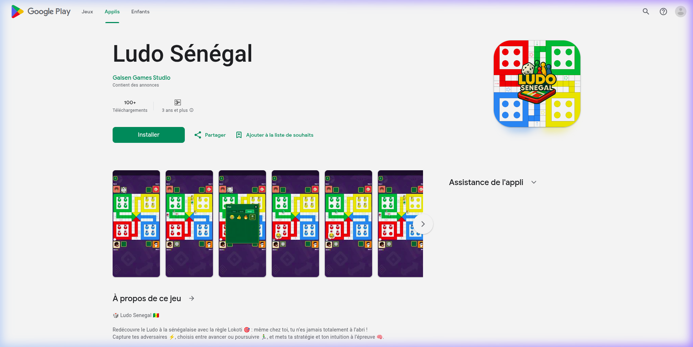
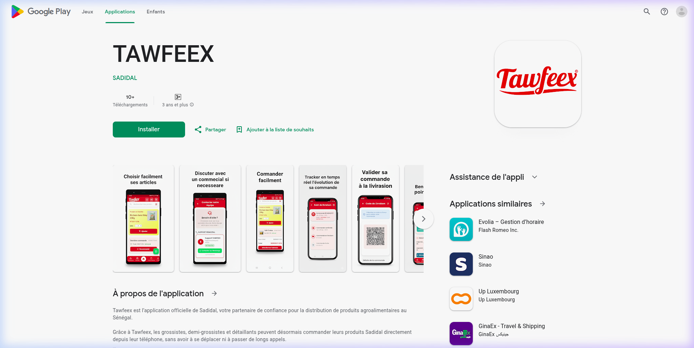
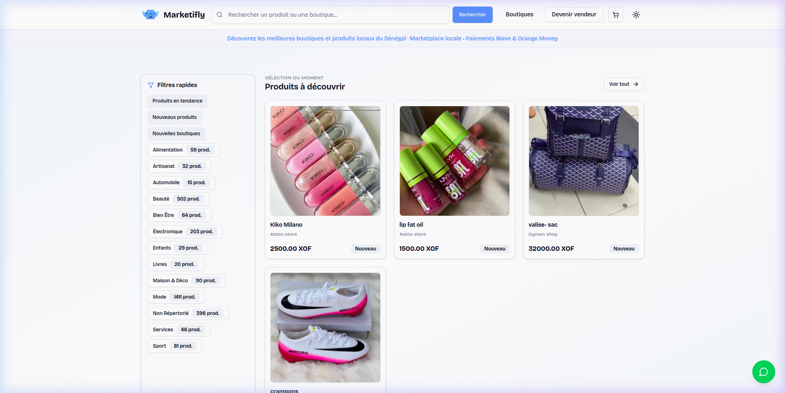
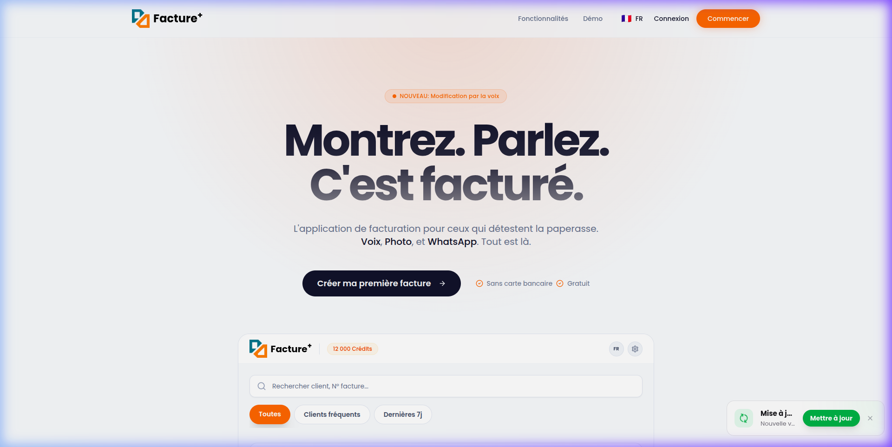

# 👋 Hi there, I'm JAC0164!

  

---

### 🚀 About Me

I am a passionate developer focused on building high-performance applications and engaging gaming experiences. I love exploring new technologies and pushing the boundaries of what's possible on the web and mobile.

<table align="center">
  <tr>
    <td width="50%" valign="top">
      <h4>🔭 Current Focus</h4>
      <ul>
        <li>Building with <b>React</b>, <b>Supabase</b>, <b>NestJS</b></li>
        <li>Deploying on <b>Kubernetes</b> & <b>Cloud</b></li>
      </ul>
    </td>
    <td width="50%" valign="top">
      <h4>🌱 Learning Path</h4>
      <ul>
        <li>Advanced <b>AI Agentic Coding</b></li>
        <li>Distributed System Architectures</li>
      </ul>
    </td>
  </tr>
</table>

  
  

---

### 🛠️ Tech Stack

<table align="center">
  <tr>
    <td align="center" width="25%"><strong>Frontend</strong></td>
    <td align="center" width="25%"><strong>Backend</strong></td>
    <td align="center" width="25%"><strong>Mobile / Game</strong></td>
    <td align="center" width="25%"><strong>DevOps / Tools</strong></td>
  </tr>
  <tr>
    <td align="center" valign="top">
       
       
       
      
    </td>
    <td align="center" valign="top">
       
       
       
      
    </td>
    <td align="center" valign="top">
       
       
       
      
    </td>
    <td align="center" valign="top">
       
       
       
      
    </td>
  </tr>
</table>

---

### 🚀 Featured Projects

<table align="center">
  <tr>
    <td width="50%" align="center">
      <a href="https://www.digifoire.com/"><strong>Digifoire</strong></a> 
      
    </td>
    <td width="50%" align="center">
      <a href="https://play.google.com/store/apps/details?id=sn.galsengames.ludosenegal"><strong>Ludo Sénégal</strong></a> 
      
    </td>
  </tr>
  <tr>
    <td width="50%" align="center">
      <a href="https://play.google.com/store/apps/details?id=com.saari.tawfeex_mobile"><strong>Tawfeex Mobile</strong></a> 
      
    </td>
    <td width="50%" align="center">
      <a href="https://marketifly.smartdevafrica.com/"><strong>Marketifly</strong></a> 
      
    </td>
  </tr>
  <tr>
    <td colspan="2" align="center">
      <a href="https://www.facture-plus.com"><strong>Facture Plus — Intelligent Invoicing</strong></a> 
      
    </td>
  </tr>
</table>

---

### 📊 Performance & Activity

<table align="center">
  <tr>
    <td width="50%" align="center">
      
    </td>
    <td width="50%" align="center">
      
    </td>
  </tr>
  <tr>
    <td colspan="2" align="center">
      
    </td>
  </tr>
</table>

---

### 🏆 Achievements & Fun

  

  

  

